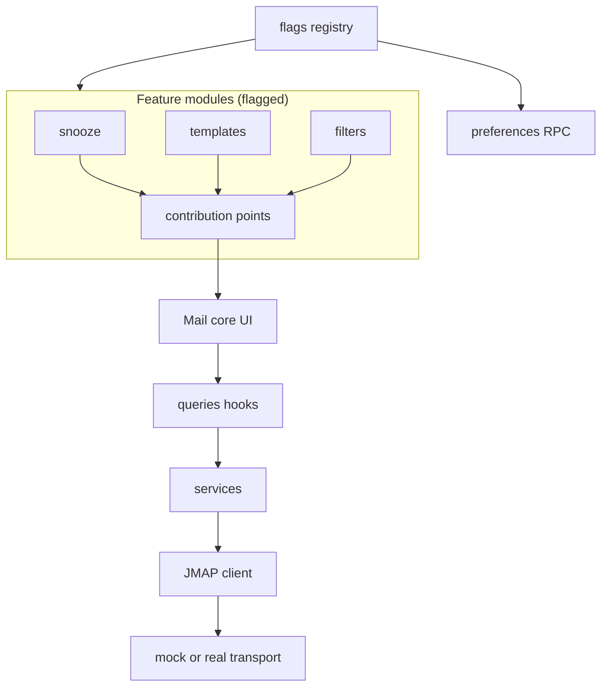

# Email Workspace — Roadmap

Single source of truth for building the mail product to Gmail/Outlook parity and
beyond, on a JMAP-native, modular, feature-flagged architecture.

> **Current audit (September 2026):** Sections 1 and 4 below preserve the original baseline and milestone proposals. The table in §3 has been updated for delivered work. Sorting and quick filters now run through JMAP before pagination; a configurable real-account worker adds queued send, a ten-second undo window, Outbox, and snooze when deployed. The remaining core work is real Stalwart scheduling validation, deploying the minute-level worker, improving offline writes and long-list navigation, and completing mobile/accessibility audits. Already delivered: mailbox CRUD, labels, advanced/saved search, Sieve sender rules, draft autosave, identities, templates, signatures, attachment preview, DOMPurify, remote-image blocking, print/export, conversation expansion, and push invalidation. Unsupported scheduling is explicitly disabled; immediate send stays available.

- **Stack:** TanStack Start/Router/Query, Tailwind v4, base-ui (shadcn `base-luma`), Tiptap, Zustand, Dexie, Zod
- **Backend contract:** JMAP (RFC 8620/8621) via Stalwart (real mode) or the in-memory `MockServer` (dev default)
- **Golden rule:** JMAP is the source of truth. No local email database. Dexie/IndexedDB is cache/offline only.

---

## 1. Current-state inventory

Audited against the running app (mock mode, `demo`/`demo`).

### 1.1 What exists today

| Layer | File(s) | Capabilities |
|---|---|---|
| App shell | `src/components/shell/app-shell.tsx`, `sidebar.tsx` | sidebar-09 layout (icon rail + contextual panel), app switcher (mail/calendar/contacts/files), compose entry, user menu |
| Command palette | `src/components/shell/command-palette.tsx` | Cmd/Ctrl+K; compose, open apps, calendar "today", jump to mailbox |
| Keyboard shortcuts | `src/lib/keyboard.ts`, `src/components/shell/keyboard-shortcuts.tsx` | `c` compose, `/` search, Cmd+R refresh, Shift+I/U read/unread, `e` archive, `#` trash, `s` star, `r`/Shift+R/`f` reply/reply-all/forward; calendar `t`/`j`/`k`. Defined but unwired: `o` open, Cmd+Enter send |
| Mail list | `src/components/mail/email-list.tsx` | Collapsed thread rows, unread dot, star/paperclip badges, snippets, 3 densities, skeleton/empty states, Ctrl/Cmd/Shift multi-select, auto-select Inbox on fresh load |
| Reading pane | `src/components/mail/thread-view.tsx` | Full thread render, reply/reply-all/forward with `inReplyTo`/`references`, attachment chips + download, per-message cards |
| Mail workspace | `src/components/mail/mail-view.tsx` | Toolbar (mark read, star, archive, trash, clear), search box, layout settings dialog, 3 reading-pane layouts |
| Composer | `src/components/mail/composer.tsx`, `src/stores/composer.store.ts` | Tiptap rich text (bold/italic/underline/lists/link), To/Cc/Bcc chips with contact autocomplete, subject, multi-file attach + remove, send, **manual** save draft, reply prefill/quote |
| Layout prefs | `src/components/mail/inbox-settings-dialog.tsx`, `src/lib/inbox-layout.ts` | Reading pane right/bottom/hidden, density, snippets; instant-save via prefs RPC |
| Search parser | `src/lib/search.ts` | `from: to: cc: bcc: subject:`, `in:/folder:/label:` (names), `has:attachment`, `is:read/unread/starred/unstarred/important/draft`, `after:/before:`, `-negation`, `"exact phrase"`, free text |
| HTML safety | `src/lib/html.ts` | Hand-rolled MVP sanitizer (strips script/style/iframe/object/embed, `on*` attrs, `javascript:` URLs); SSR regex fallback; **not DOMPurify-grade** |
| Queries | `src/queries/mail.ts` | `useMailboxes`, `useIdentities`, `useEmails`, `useThread`; mutations: markRead, markStarred, archive, trash, restore, send, saveDraft, upload/downloadAttachment |
| Mail service | `src/services/mail/mail.service.ts` | Domain API over JMAP client incl. `moveEmails` (no hook yet), draft cleanup on send |
| JMAP client | `src/jmap/client/*` | Batching, result references, retries, abort, upload/download, push (`startPush`), typed Mail/Calendar/Contacts/Files APIs |
| JMAP methods (client) | `MailApi.ts` | `Mailbox/get`, `Email/query`, `Email/get`, `Email/set`, `Thread/get`, `EmailSubmission/set`, `Identity/get` |
| Mock server | `src/jmap/provider/mock/MockServer.ts` | All client methods **plus** `Email/changes`, `Mailbox/changes`; state ticks; push emitter; seeded demo data |
| Auth/server | `src/server/*` | Mock or Stalwart JWT login, HTTP-only session cookie, JMAP proxy (session/request/upload/download), prefs in encrypted cookie |
| Dormant infra | `src/db/db.ts`, `src/jmap/sync/sync.engine.ts` | Dexie schema (mailboxes/emails/threads/identities/events/contacts/files/syncMeta) + sync engine — **defined but not wired into the UI** |
| Other apps | `src/components/calendar|contacts|files/*` | Calendar: month grid, create/delete events (no edit UI; week/day/agenda views unimplemented). Contacts: full CRUD. Files: browse/upload/download/delete (no rename/move UI) |

### 1.2 Gap analysis vs the 60-feature spec

**Exists (working):** inbox list, threaded reading, read/unread, star, archive, trash/restore, compose, reply/reply-all/forward, attachments up/download, operator search, layout density prefs, partial shortcuts, partial palette, mock+real JMAP providers.

**Partial (needs finishing):**
- Bulk actions — toolbar exists; no select-all, no mark-unread/unstar buttons, no move/label/snooze in bulk bar
- Drafts — manual save only; no autosave, no reopen-into-composer, no saving indicator
- Search — parser strong; no advanced-search UI, no saved searches, `in:` name resolution not wired in list path
- Real-time — push + `Email/changes` exist end-to-end but nothing calls `startPush`
- Offline — Dexie + sync engine exist but are unwired
- Identities — `useIdentities` exists; composer hard-codes first identity, no From picker
- Refresh — toolbar button has no `onClick` (shortcut works)
- HTML sanitization — MVP allowlist; needs DOMPurify-grade module
- Move — `mailService.moveEmails` exists; no hook, no UI

**Missing:** mailbox CRUD (`Mailbox/set` not implemented anywhere), labels UI, snooze, scheduled send, undo send, outbox, filters/rules, templates, signatures UI, spam/phishing flows, attachment viewer, image blocking, thread collapse/expand, print/export, raw message view, smart inbox, waiting-on, follow-ups, email→task/calendar, contact sidebar, context panel, AI features, unified search, multi-account, notifications, feature flags, module system.

**Known stability bug:** Tiptap "Duplicate extension names: link, underline" warning loops in the dev server console relay and has killed `pnpm dev` twice (exit 134). Composer registers `Link`/`Underline` on top of StarterKit, which already includes them. Fix in M0.

---

## 2. Target modular architecture

### 2.1 Layering (keep and enforce)

```text
UI components (feature modules)
  → queries (React Query hooks)        src/queries/
  → services (domain logic)            src/services/
  → JMAP client (protocol)             src/jmap/client/
  → transport (mock | server proxy)    src/jmap/provider/
```

Rules:
- Components never import from `src/jmap/**` directly — only via `src/queries/**`.
- Services never construct raw JMAP invocations — only via `src/jmap/client/*Api.ts`.
- New JMAP methods are added once to the client API **and** to `MockServer`, keeping mock/real parity.

### 2.2 Feature module system

New top-level structure:

```text
src/features/
  registry.ts        # defineFeature({ id, title, description, defaultEnabled, apps, requires? })
  flags.ts           # useFeatureFlag(id), useFeatureToggles() — backed by preferences RPC
  contributions.ts   # typed registries: toolbar actions, thread actions, composer extensions,
                     # palette items, shortcuts, sidebar panels, settings sections
src/modules/
  mail/
    labels/
    snooze/
    scheduled-send/
    templates/
    signatures/
    filters/
    ...
```

Each module is self-contained:

```text
src/modules/mail/snooze/
  index.ts           # registers the feature + its contributions
  feature.ts         # defineFeature({ id: "mail.snooze", ... })
  SnoozeMenu.tsx
  useSnooze.ts       # query/mutation hooks (wrap src/queries additions)
  snooze.service.ts  # domain logic (delegates to mail service)
```

**Flag storage:** extend `UserPreferences` in `src/server/preferences.rpc.ts` with
`features: Record<string, boolean>`. `useFeatureFlag(id)` resolves
`prefs.features[id] ?? registry[id].defaultEnabled`, with optimistic writes via the
existing `useSaveInboxLayout`-style mutation pattern. Flags are per-user, instant,
and survive reload (session cookie today; profile store when multi-account lands).

**Contribution points** (core renders only enabled features' contributions):

| Point | Consumed by | Example |
|---|---|---|
| `mailToolbarActions` | `mail-view.tsx` toolbar | Snooze, Move, Label, Spam |
| `threadActions` | `thread-view.tsx` header | Print, View original, Create task |
| `composerExtensions` | `composer.tsx` | Templates, signatures, schedule send |
| `paletteItems` | `command-palette.tsx` | "Create filter", "Open Outbox" |
| `shortcuts` | `keyboard-shortcuts.tsx` | `z` snooze, `v` move, `l` label |
| `sidebarPanels` | `shell/sidebar.tsx` secondary panel | Labels section, Outbox |
| `settingsSections` | settings dialog | Feature toggles, signature editor |

**Core is never flagged:** inbox, threads, compose, send, read/unread, star,
archive, trash, search, shell. Everything else is a module with a flag.

### 2.3 Settings UI

Extend the existing instant-save dialog pattern into a tabbed **Settings dialog**:
`General` (current layout prefs), `Features` (toggle list from the registry),
`Signatures`, `Templates`, `Filters`, `Shortcuts` (later milestones add tabs without
restructuring).

### 2.4 Architecture diagram



---

## 3. Feature matrix

Status: **yes** = shipped, **part** = partial, **no** = missing.
Flag id `—` = core (never flagged). Priorities map to milestones in §4.

| # | Feature | Status | Module / location | Flag id | JMAP dependency | Priority |
|---|---|---|---|---|---|---|
| 0 | Product architecture (entities, layering) | yes | existing `src/services`, `src/jmap` | — | — | M0 |
| 1 | Inbox (threaded list, unread, previews, selection) | yes | `components/mail/email-list.tsx` | — | `Email/query` + `collapseThreads` | M0 |
| 1a | Inbox: infinite/paginated loading | part (pages + jump) | core list | — | `Email/query` position/anchor | M1 |
| 1b | Inbox: real-time updates | part (push invalidation) | core + sync wiring | — | `Email/changes`, push | M0 |
| 2 | Mailbox/folder system (read) | yes | `shell/sidebar.tsx` | — | `Mailbox/get` | M0 |
| 2a | Mailbox CRUD + custom folders | yes | `modules/mail/mailboxes` | `mail.mailboxes` | `Mailbox/set` (client + mock) | M0 |
| 3 | Labels (multi-mailbox model) | yes | `modules/mail/labels` | `mail.labels` | `Mailbox/set`, multi-membership | M0 |
| 4 | Threaded conversations | part | `thread-view.tsx` | — | `Thread/get` | M0 (collapse/expand, quoted-content folding in M1) |
| 5 | Reading pane + actions | part | `thread-view.tsx` | — | — | M0 (add move/label/snooze/print via contribution points) |
| 6 | Compose (Tiptap) | yes | `components/mail/composer.tsx` | — | `Email/set`, `EmailSubmission/set` | M0 (fix duplicate-extension bug) |
| 7 | Recipient system (autocomplete, chips) | part | composer + `queries/contacts.ts` | — | `Contact/query` | M1 (recents, validation warnings, groups) |
| 8 | Drafts (autosave, restore, indicators) | yes | composer | — | `Email/set` update, debounce queue | M0 |
| 9 | Send (stateful pipeline) | yes | composer + mail service | — | `EmailSubmission/set` | M0 |
| 10 | Scheduled send | part (worker validation pending) | mail jobs + composer | — | durable queue + `EmailSubmission/set` | M1 |
| 11 | Snooze | part (worker validation pending) | mail jobs + conversation | — | archive + `$snoozed` + restore job | M1 |
| 12 | Search (operators) | yes | `lib/search.ts` | — | `Email/query` filter | M0 (wire `in:` name→id resolution) |
| 13 | Advanced search UI + saved searches | yes | `components/mail/advanced-search.tsx` | — | same filter object | M1 |
| 14 | Bulk actions | yes | core toolbar | — | batched `Email/set` | M0 |
| 15 | Star/flag | yes | core | — | `$flagged` | M0 |
| 16 | Read/unread | yes | core | — | `$seen` | M0 (add toolbar mark-unread) |
| 17 | Archive | yes | core | — | mailbox membership | M0 |
| 18 | Trash/delete/restore/empty | yes | core | — | `Email/set` mailboxIds/destroy | M1 |
| 19 | Spam/phishing | yes | core | — | `$junk`, `$phishing` keywords | M1 |
| 20 | Attachments (up/download) | yes | core | — | upload/download endpoints | M0 |
| 21 | Attachment viewer (image/PDF/text preview) | yes | `components/mail/attachment-viewer.tsx` | — | download blob → object URL | M1 |
| 22 | Image handling (block remote, CID inline) | part | `lib/email-renderer/images.ts` | — | bodyValues + CID rewrite | M1 |
| 23 | Signatures (per identity) | yes | composing settings + composer | — | prefs storage; composer injection | M1 |
| 24 | Templates | yes | composer + settings | — | account metadata | M1 |
| 25 | Filters/rules | part (Sieve sender rules) | settings | — | SieveScript | M1 |
| 26 | Smart inbox categories | no | `modules/mail/smart-inbox` | `mail.smartInbox` | deterministic rules over metadata | M2 |
| 27 | "Waiting on" | no | `modules/mail/waiting-on` | `mail.waitingOn` | Sent ∩ no-reply heuristic via `Email/query` | M2 |
| 28 | Follow-up reminders | no | `modules/mail/follow-ups` | `mail.followUps` | keyword + local scheduler | M2 |
| 29 | Email → Task | no | `modules/mail/email-to-task` | `mail.emailToTask` | new Tasks store (Dexie/prefs) | M2 |
| 30 | Email → Calendar | no | `modules/mail/email-to-calendar` | `mail.emailToCalendar` | `CalendarEvent/set` (exists) | M2 |
| 31 | Contact sidebar | no | `modules/mail/contact-sidebar` | `mail.contactSidebar` | `Contact/query` + `Email/query` | M2 |
| 32 | Context panel | no | `modules/mail/context-panel` | `mail.contextPanel` | cross-app queries | M2 |
| 33 | AI assistant | no | `modules/mail/ai-assistant` | `mail.ai` | server AI endpoint (new) | M2 |
| 34 | Thread summary | no | inside ai-assistant | `mail.ai` | — | M2 |
| 35 | AI reply | no | inside ai-assistant | `mail.ai` | — | M2 |
| 36 | AI action extraction | no | inside ai-assistant | `mail.ai` | — | M2 |
| 37 | Unified workspace search | no | `modules/workspace/search` | `workspace.unifiedSearch` | per-app `*/query` fan-out | M2 |
| 38 | Offline mode | part (cached reading) | sync engine | — | Dexie + mutation queue later | M3 |
| 39 | Real-time updates | part (push invalidation) | core sync wiring | — | `startPush` + `*/changes` | M0 |
| 40 | Multiple accounts | no | `modules/system/accounts` | `system.multiAccount` | `accountId` in all query keys (replace `ACCOUNT_KEY = "acc"`) | M3 |
| 41 | Multiple identities | part | `modules/mail/identities` | `mail.identities` | `Identity/get` (exists) | M1 |
| 42 | Outbox | part (worker validation pending) | mail jobs + Outbox dialog | — | server queue | M1 |
| 43 | Undo send | part (10-second queued window) | composer + Outbox | — | delayed submission | M1 |
| 44 | Confidential/protected email | no | `modules/mail/confidential` | `mail.confidential` | server capability required | M3 |
| 45 | Print/export (.eml, print thread) | yes | thread view | — | `Email/get` full + blob | M1 |
| 46 | Raw message / headers | yes | thread view | — | `Email/get` `headers`, `bodyStructure` | M1 |
| 47 | Keyboard shortcuts (full map + `?` help) | part | core + contributions | — | — | M1 |
| 48 | Command palette (full coverage) | part | core + contributions | — | — | M1 |
| 49 | Notifications | no | `modules/system/notifications` | `system.notifications` | push events → toast/Web Notification | M2 |
| 50 | Preferences (full settings) | part | settings dialog | — | prefs RPC (exists) | M1 |
| 51 | Inbox density | yes | `inbox-settings-dialog.tsx` | — | — | done |
| 52 | Responsive/mobile | part | shell + views | — | `useIsMobile` + Sheet sidebar (exists) | M2 |
| 53 | Accessibility | part | all UI | — | base-ui primitives help; audit needed | M2 |
| 54 | Security (sanitizer, headers, cookies) | part | `lib/email-renderer/sanitize.ts` | — | DOMPurify; HTTP-only cookies (exist) | M0 |
| 55 | Email rendering engine | part | `lib/email-renderer/` (new module) | — | sanitize/html/plaintext/links/images/quotes | M0–M1 |
| 56 | Email analytics/overview | no | `modules/mail/overview` | `mail.overview` | mailbox counters (exist) | M2 |
| 57 | Smart triage | no | `modules/mail/smart-triage` | `mail.smartTriage` | rules → AI later | M3 |
| 58 | Bulk workflow automation | no | `modules/workspace/automation` | `workspace.automation` | batched ops | M3 |
| 59 | Email-to-workflow | no | `modules/workspace/automation` | `workspace.automation` | filters engine + files/tasks | M3 |
| 60 | Shared/team inbox | no | `modules/workspace/shared-inbox` | `workspace.sharedInbox` | multi-account + assignment metadata | M3 |

---

## 4. Milestones

Each item lists: module/flag, JMAP work (client + mock parity), acceptance criteria.

### M0 — Foundations, flags, and P0 finish

Goal: genuinely usable daily mail client; architecture for everything after.

1. **Feature-flag system** — `src/features/{registry,flags,contributions}.ts`; `features` map in `UserPreferences`; Features tab in settings.
   - *Accept:* toggling a flag adds/removes its toolbar/palette contributions without reload; state persists across sessions.
2. **Email renderer module** — `src/lib/email-renderer/{sanitize,html,plaintext,links,images,quote-collapse}.ts`; replace hand-rolled sanitizer with DOMPurify; mandatory before any `dangerouslySetInnerHTML`.
   - *Accept:* XSS fixture suite passes; script/style/event-handler/`javascript:` payloads stripped; SSR fallback intact.
3. **Tiptap dedupe fix** — remove duplicate `Link`/`Underline` registration in composer; cap dev console relay.
   - *Accept:* no duplicate-extension warning; dev server survives a full session.
4. **Mailbox CRUD** — `Mailbox/set` in `MailApi` + `MockServer`; `modules/mail/mailboxes` (flag `mail.mailboxes`); create/rename/delete in sidebar.
   - *Accept:* create → appears in sidebar with correct counts; delete → mails move to Trash.
5. **Labels** — `modules/mail/labels` (flag `mail.labels`); labels-as-mailboxes with multi-membership; apply/remove UI on thread + bulk; label chips in list rows; sidebar section.
   - *Accept:* one email visible under Inbox + two labels; removing label keeps email in Inbox.
6. **Drafts autosave** — debounced (2s) `Email/set` update on the same draft id; mutation queue to serialize saves; saving/saved indicator; reopen draft from Drafts into composer; discard confirmation.
   - *Accept:* refresh mid-compose restores everything; no duplicate drafts in Drafts mailbox.
7. **Bulk actions completion** — select-all (current page), mark unread, unstar, move, label in toolbar; all batched into single `Email/set`.
   - *Accept:* 20 selected → archive+read in one JMAP request.
8. **Real-time wiring** — call `startPush` once per session; on event → invalidate `["acc","emails"]` + mailboxes; mock emitter already fires on mutations.
   - *Accept:* marking read in a second tab/action updates list without reload.
9. **Move UI + hook** — `useMoveEmails` over existing `mailService.moveEmails`; Move dialog (mailbox tree).
10. **Search `in:` resolution** — resolve mailbox names to ids in the list path; wire Refresh button.
11. **Send states** — sending spinner, sent toast, failure with retry; thread actions row (archive/delete/unread/star/move/label) via contribution points.

### M1 — Serious email client

| Feature | Module / flag | Notes |
|---|---|---|
| Snooze | `modules/mail/snooze`, `mail.snooze` | `$snoozed` keyword + Snoozed mailbox; restore via timestamp check on sync; never deletes |
| Scheduled send | `modules/mail/scheduled-send`, `mail.scheduledSend` | `holdFor`/future `EmailSubmission` where server supports; else app-level queue in Outbox |
| Undo send | `modules/mail/undo-send`, `mail.undoSend` | configurable 5–30s delay window before `EmailSubmission/set` fires |
| Outbox | `modules/mail/outbox`, `mail.outbox` | sending/scheduled/failed list; retry |
| Filters/rules | `modules/mail/filters`, `mail.filters` | condition builder → `EmailFilterOperator`; actions via batched `Email/set`; run on demand + on arrival (push hook) |
| Templates | `modules/mail/templates`, `mail.templates` | prefs-stored; `{{var}}` interpolation; composer picker |
| Signatures | `modules/mail/signatures`, `mail.signatures` | per-identity; rich text; auto-insert in composer |
| Identities | `modules/mail/identities`, `mail.identities` | From picker in composer; per-identity signature/reply-to |
| Advanced search | `modules/mail/advanced-search`, `mail.advancedSearch` | form → parser string; saved searches in prefs |
| Spam/phishing | `modules/mail/spam`, `mail.spam` | `$junk`/`$phishing` keywords; phishing warning banner; Not spam |
| Attachment viewer | `modules/mail/attachment-viewer`, `mail.attachmentViewer` | image/PDF/text preview dialog; uses `lib/attachments.ts` helpers |
| Remote images | `lib/email-renderer/images.ts`, `mail.remoteImages` | block-by-default, "Load images", per-sender allowlist |
| Thread UX | core | collapse/expand messages, expand-all, quoted-content folding |
| Print/export | `modules/mail/print-export`, `mail.printExport` | print thread, download .eml |
| Raw message | `modules/mail/raw-message`, `mail.rawMessage` | headers + view original |
| Shortcuts + palette | core + contributions | wire `o`, Cmd+Enter, `v`/`l`/`z`; `?` cheatsheet; palette covers all enabled features |
| Empty trash | core | `Email/set` destroy for trash members, with confirm |
| Recipient upgrades | composer | recent/frequent recipients, invalid-address warning |
| Inbox pagination | core list | `position`/`anchor` infinite scroll, scroll restoration |

### M2 — Differentiation

Waiting-on (`mail.waitingOn`), follow-up reminders (`mail.followUps`), email→task (`mail.emailToTask`), email→calendar (`mail.emailToCalendar`), contact sidebar (`mail.contactSidebar`), context panel (`mail.contextPanel`), smart inbox categories — deterministic rules first (`mail.smartInbox`), unified workspace search (`workspace.unifiedSearch`), notifications (`system.notifications`), AI assistant suite (`mail.ai`: summarize/reply/action-extraction, clearly labeled AI output, always-editable drafts), responsive/mobile navigation pass, accessibility audit (focus management, ARIA, reduced motion), email overview dashboard (`mail.overview`).

### M3 — Platform

Offline (`system.offline`: activate Dexie + sync engine + offline mutation queue; compose/queue sends offline), multi-account (`system.multiAccount`: `accountId` in every query key — replaces `ACCOUNT_KEY = "acc"` debt; account switcher; per-account prefs), shared/team inbox (`workspace.sharedInbox`), workflow automation + email-to-workflow (`workspace.automation`), smart triage with AI fallback (`mail.smartTriage`), confidential mode (`mail.confidential`, server-dependent).

---

## 5. Implementation rules (binding)

1. **JMAP-native.** No local email DB as source of truth; Dexie is cache/offline only.
2. **Layer discipline.** UI → queries → services → client → transport. No shortcuts.
3. **Mock/real parity.** Every new JMAP method lands in `MailApi` (or peers) **and** `MockServer` in the same change.
4. **Module completeness.** A flagged feature ships with: module folder, `defineFeature` entry, contributions (toolbar/palette/shortcut as applicable), settings toggle, and tests.
5. **Batch mutations.** Bulk actions use a single `Email/set`; never N requests.
6. **Security invariants.** All email HTML through `email-renderer/sanitize`; no credentials in localStorage; destructive actions (delete, empty trash) always confirm.
7. **Non-destructive semantics.** Archive/snooze remove Inbox membership only; nothing is deleted unless the user explicitly trashes/empties.
8. **Optimistic UI** for read/star/label mutations, with rollback on error (existing prefs mutation pattern is the reference).
